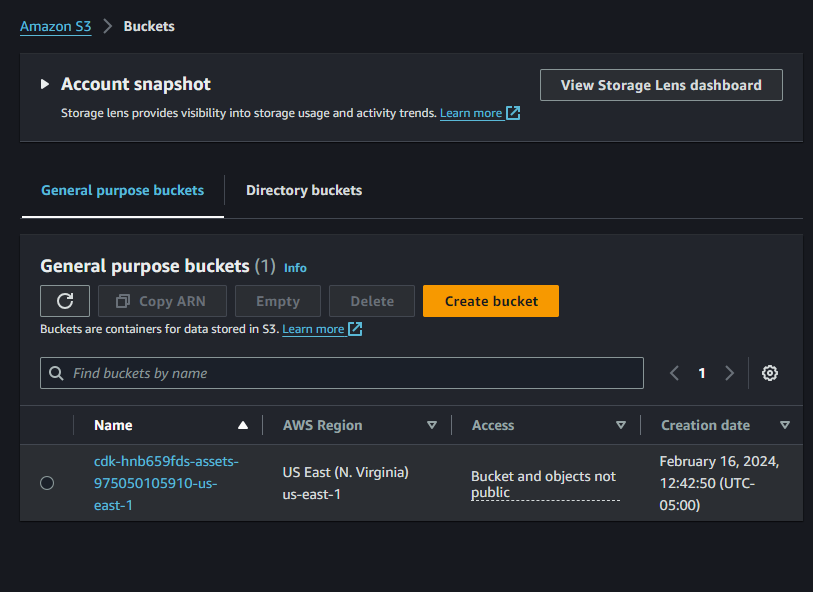

# AWS CDK S3 Bucket Creation with CodeWhisperer

This project involved creating an Amazon S3 bucket using the AWS Cloud Development Kit (CDK) and CodeWhisperer. These steps were obtained with the help of CodeWhisperer.

## Components

- AWS CDK
- Node.js and npm
- AWS account
- CodeWhisperer

## Steps

1. **Install AWS CDK Toolkit:**

```bash
npm install -g aws-cdk
```

2. **Create a new directory for the AWS CDK app:**

```bash
mkdir MyCDKApp
cd MyCDKApp
```

3. **Initialize the AWS CDK app:**

```bash
cdk init app --language python
```

This will create a new directory called `my-cdk-app` with the all the necessary files and code for the CDK app.

4. **Go to AWS Console, create a user with the appropriate permissions and policies to automatically create cloudformation and S3 instances**

5. **Synthesize and deploy the AWS CDK app:**

```bash
cdk synth
cdk deploy
```

#### The appropriate structure and steps were obtained with the help of CodeWhisperer and the python code was generated using the AWS CDK. 


**The screenshot below shows the AWS S3 bucket created using the AWS CDK and CodeWhisperer.**

